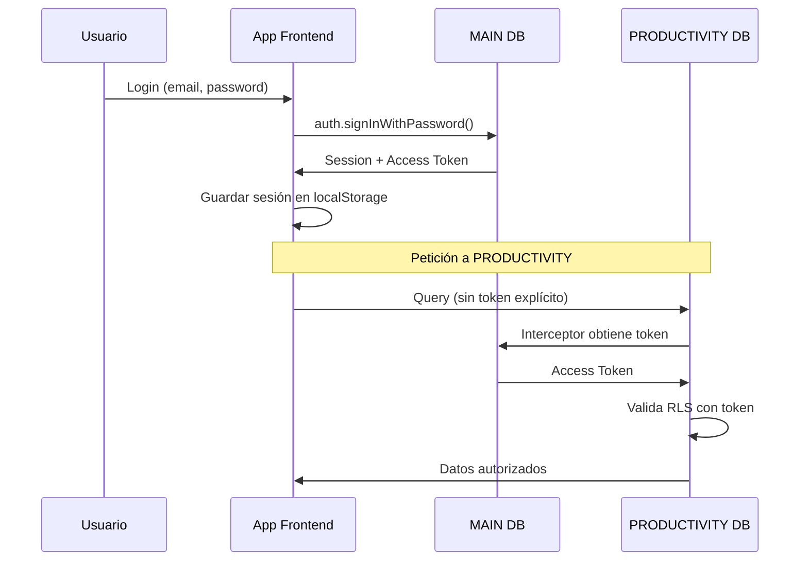
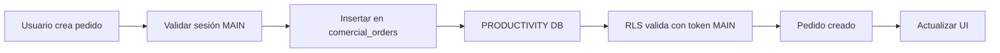
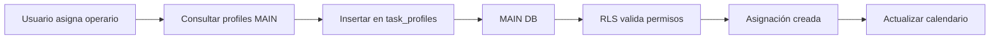
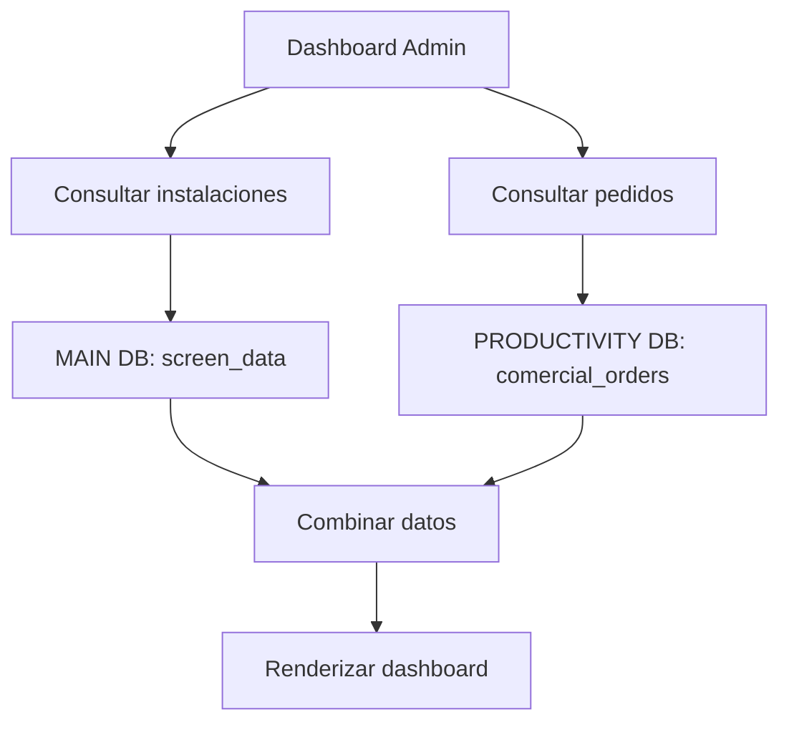

# Arquitectura del Sistema Egea Productivity

**Versión**: 2.0  
**Última actualización**: 9 de enero de 2026

---

## 📐 Visión General

Egea Productivity es una aplicación modular diseñada con una **arquitectura dual de bases de datos** que separa las responsabilidades core de la aplicación de los módulos de negocio.

```
┌─────────────────────────────────────────────────────────────┐
│                    EGEA PRODUCTIVITY APP                     │
├─────────────────────────────────────────────────────────────┤
│                                                              │
│  ┌──────────────────┐              ┌────────────────────┐  │
│  │  MAIN DATABASE   │              │ PRODUCTIVITY DB    │  │
│  ├──────────────────┤              ├────────────────────┤  │
│  │ • Autenticación  │◄────────────►│ • Comercial        │  │
│  │ • Usuarios       │   Shared     │ • Producción       │  │
│  │ • Permisos       │   Auth       │ • Logística        │  │
│  │ • Recursos       │   Token      │ • Almacén          │  │
│  │ • Instalaciones  │              │ • Materiales       │  │
│  └──────────────────┘              └────────────────────┘  │
│                                                              │
└─────────────────────────────────────────────────────────────┘
```

---

## 🎯 Principios de Diseño

### 1. Separación de Responsabilidades

**MAIN Database**: Core de la aplicación
- Gestión de usuarios y autenticación
- Sistema de permisos y roles
- Recursos compartidos (vehículos, operarios)
- Módulo de instalaciones

**PRODUCTIVITY Database**: Módulos de negocio
- Gestión comercial (pedidos, clientes)
- Producción (órdenes de trabajo)
- Logística (envíos, almacén)
- Materiales y recursos productivos

### 2. Modularidad

Cada módulo de negocio puede:
- Escalar independientemente
- Desplegarse por separado
- Tener backups diferenciados
- Evolucionar sin afectar el core

### 3. Autenticación Centralizada

- Un solo punto de autenticación (MAIN)
- Token compartido entre bases de datos
- RLS (Row Level Security) en ambas bases de datos
- Sesión sincronizada automáticamente

---

## 🔐 Flujo de Autenticación



### Implementación del Interceptor

```typescript
// src/integrations/supabase/client.ts
const fetchWithMainAuth = async (url, options) => {
  // 1. Obtener token de MAIN
  const { data: { session } } = await supabaseMain.auth.getSession();
  
  // 2. Inyectar token en headers
  const headers = new Headers(options.headers);
  if (session?.access_token) {
    headers.set('Authorization', `Bearer ${session.access_token}`);
  }
  
  // 3. Ejecutar petición con token
  return fetchWithRetry(url, { ...options, headers });
};

// Cliente PRODUCTIVITY usa el interceptor
export const supabaseProductivity = createClient(
  productivityUrl,
  productivityAnonKey,
  {
    auth: {
      persistSession: false, // No crea GoTrueClient propio
      autoRefreshToken: false,
      detectSessionInUrl: false,
      storage: null
    },
    global: {
      fetch: fetchWithMainAuth // ✅ Usa interceptor
    }
  }
);
```

---

## 🗂️ Estructura de Módulos

### Módulos MAIN

#### 1. **Autenticación y Usuarios**
- **Tablas**: `profiles`, `role_permissions`
- **Responsabilidad**: Gestión de usuarios, roles y permisos
- **Cliente**: `supabaseMain`

#### 2. **Recursos**
- **Tablas**: `vehicles`
- **Responsabilidad**: Gestión de vehículos y recursos compartidos
- **Cliente**: `supabaseMain`

#### 3. **Instalaciones**
- **Tablas**: `screen_data`, `screens`, `templates`, `task_profiles`, `task_vehicles`
- **Responsabilidad**: Gestión de instalaciones y montajes
- **Cliente**: `supabaseMain`

#### 4. **Configuración**
- **Tablas**: `screens`, `templates`, `screen_groups`
- **Responsabilidad**: Configuración de pantallas y grupos
- **Cliente**: `supabaseMain`

### Módulos PRODUCTIVITY

#### 1. **Comercial**
- **Tablas**: `comercial_orders`, `order_documents`, `status_log`
- **Responsabilidad**: Gestión de pedidos, clientes y documentación
- **Cliente**: `supabaseProductivity`

#### 2. **Producción**
- **Tablas**: `produccion_work_orders`
- **Responsabilidad**: Órdenes de trabajo y fabricación
- **Cliente**: `supabaseProductivity`

#### 3. **Logística**
- **Tablas**: `logistics`
- **Responsabilidad**: Envíos, almacén y distribución
- **Cliente**: `supabaseProductivity`

#### 4. **Materiales**
- **Tablas**: `materials`
- **Responsabilidad**: Catálogo de materiales y referencias
- **Cliente**: `supabaseProductivity`

---

## 🔄 Flujos de Datos

### Flujo 1: Crear Pedido Comercial



### Flujo 2: Asignar Operarios a Instalación



### Flujo 3: Dashboard Admin (Datos Mixtos)



---

## 🛡️ Seguridad

### Row Level Security (RLS)

Ambas bases de datos implementan RLS:

**MAIN**:
```sql
-- Solo admins pueden ver todos los perfiles
CREATE POLICY "Admins can view all profiles"
ON profiles FOR SELECT
USING (
  auth.uid() IN (
    SELECT auth_user_id FROM profiles WHERE role = 'admin'
  )
);
```

**PRODUCTIVITY**:
```sql
-- Solo usuarios autenticados pueden ver pedidos
CREATE POLICY "Authenticated users can view orders"
ON comercial_orders FOR SELECT
USING (auth.uid() IS NOT NULL);
```

### Validación de Token

El interceptor `fetchWithMainAuth` asegura que:
1. Todas las peticiones a PRODUCTIVITY incluyen el token de MAIN
2. RLS valida el token en cada query
3. No hay acceso sin autenticación

---

## 📊 Ventajas de la Arquitectura Dual

### ✅ Escalabilidad
- Cada base de datos puede escalar independientemente
- Optimizaciones específicas por módulo
- Distribución de carga

### ✅ Mantenibilidad
- Cambios en PRODUCTIVITY no afectan MAIN
- Migraciones independientes
- Rollbacks selectivos

### ✅ Seguridad
- Aislamiento de datos sensibles
- Permisos granulares por base de datos
- Auditoría diferenciada

### ✅ Flexibilidad
- Nuevos módulos de negocio sin tocar core
- Posibilidad de migrar módulos a otros servicios
- Arquitectura preparada para microservicios

---

## ⚠️ Consideraciones

### Warning "Multiple GoTrueClient instances"

**Estado**: Esperado y benigno

**Razón**: Supabase detecta dos clientes (MAIN y PRODUCTIVITY)

**Por qué es seguro**:
1. Solo MAIN maneja autenticación
2. PRODUCTIVITY usa interceptor (no crea GoTrueClient propio)
3. No hay operaciones concurrentes sobre las mismas tablas
4. Diferentes bases de datos = sin conflicto de datos

**Documentado en**: `src/integrations/supabase/client.ts` líneas 49-65

### Sincronización de Datos

**No hay sincronización automática** entre bases de datos.

Si necesitas datos de ambas:
```typescript
// ✅ CORRECTO - Consultas paralelas
const [installations, orders] = await Promise.all([
  supabaseMain.from('screen_data').select('*'),
  supabaseProductivity.from('comercial_orders').select('*')
]);

// Combinar en el frontend
const combined = { installations, orders };
```

---

## 🚀 Evolución Futura

### Posibles Mejoras

1. **GraphQL Gateway**: Unificar acceso a ambas bases de datos
2. **Event Bus**: Comunicación asíncrona entre módulos
3. **Caché Compartido**: Redis para datos frecuentes
4. **API Gateway**: Centralizar autenticación y routing

### Migración a Microservicios

La arquitectura dual facilita la migración:
- MAIN → Core Service
- Comercial → Orders Service
- Producción → Manufacturing Service
- Logística → Logistics Service

---

## 📚 Referencias

- [SUPABASE_CLIENTS_GUIDE.md](./SUPABASE_CLIENTS_GUIDE.md) - Guía de uso de clientes
- [DATABASE_STRUCTURE.md](./DATABASE_STRUCTURE.md) - Esquema de MAIN
- [Supabase Docs](https://supabase.com/docs) - Documentación oficial

---

**Mantenedor**: Equipo de Desarrollo Egea  
**Contacto**: [Tu email/contacto]
