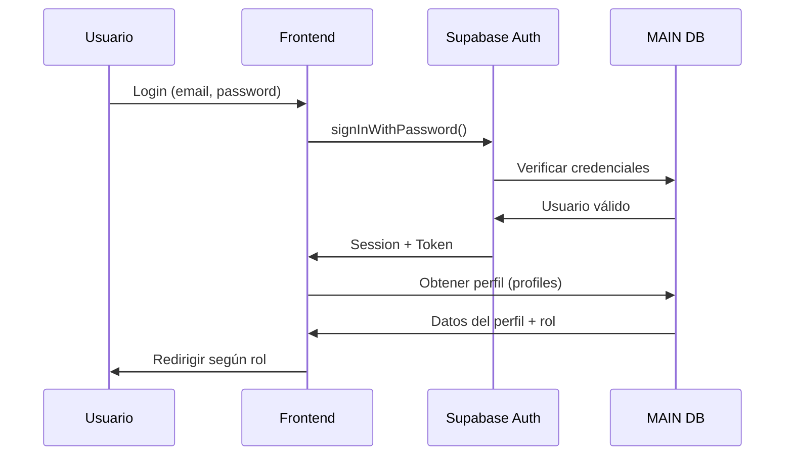

# 🔐 Módulo de Autenticación y Usuarios

**Base de datos**: MAIN  
**Responsabilidad**: Gestión de usuarios, roles, permisos y autenticación

---

## 📋 Descripción

El módulo de autenticación es el **core de seguridad** de la aplicación. Gestiona el registro, login, permisos y roles de todos los usuarios del sistema.

---

## 🗄️ Tablas

### `profiles`
Perfiles de usuario del sistema.

**Columnas principales**:
- `id` - UUID del perfil
- `auth_user_id` - Relación con auth.users de Supabase
- `full_name` - Nombre completo
- `email` - Email
- `phone` - Teléfono
- `role` - Rol del usuario (admin, responsable, operario, manager, jefe_almacen, operario_almacen)
- `status` - Estado (activo, vacaciones, baja)
- `avatar_url` - URL del avatar

### `role_permissions`
Permisos granulares por rol y página.

**Columnas principales**:
- `role` - Rol del usuario
- `page` - Página/recurso
- `can_view` - Puede ver
- `can_edit` - Puede editar
- `can_delete` - Puede eliminar

---

## 🔒 Políticas RLS

### Lectura de Perfiles
```sql
-- Los usuarios pueden ver su propio perfil
CREATE POLICY "users_can_view_own_profile"
  ON profiles FOR SELECT
  USING (auth_user_id = auth.uid());

-- Los admins pueden gestionar todos los perfiles
CREATE POLICY "admins_can_manage_profiles"
  ON profiles FOR ALL
  USING (public.is_admin());
```

### Permisos
```sql
-- Todos los autenticados pueden ver permisos
CREATE POLICY "authenticated_can_view_role_permissions"
  ON role_permissions FOR SELECT
  USING (true);

-- Solo admins pueden modificar permisos
CREATE POLICY "admins_can_manage_role_permissions"
  ON role_permissions FOR ALL
  USING (public.is_admin());
```

---

## 👥 Roles del Sistema

### Admin
- **Acceso**: Total
- **Permisos**: Crear, editar, eliminar todo
- **Páginas**: Todas

### Responsable
- **Acceso**: Gestión de operaciones
- **Permisos**: Ver todo, editar instalaciones, comercial, comunicaciones
- **Páginas**: Dashboard, Instalaciones, Comercial, Usuarios (solo ver), Comunicaciones

### Operario
- **Acceso**: Limitado a sus tareas
- **Permisos**: Ver sus tareas asignadas, actualizar estado
- **Páginas**: Workday, Mis Tareas

### Manager
- **Acceso**: Similar a Responsable
- **Permisos**: Gestión completa de operaciones
- **Páginas**: Dashboard, Instalaciones, Comercial, Producción

### Jefe de Almacén
- **Acceso**: Gestión de almacén
- **Permisos**: Ver y editar logística, materiales, envíos
- **Páginas**: Almacén, Envíos, Producción (ver)

### Operario de Almacén
- **Acceso**: Escaneo y gestión básica
- **Permisos**: Escanear paquetes, actualizar envíos
- **Páginas**: Almacén (limitado), Envíos

---

## 🔄 Flujo de Autenticación



---

## 📄 Componentes Principales

### Frontend

- **[Auth.tsx](file:///c:/Users/Usuari/Documents/GitHub/MainV2/v3/egea-Main-control/src/pages/Auth.tsx)** - Página de login
- **[AuthGuard.tsx](file:///c:/Users/Usuari/Documents/GitHub/MainV2/v3/egea-Main-control/src/components/AuthGuard.tsx)** - Protección de rutas
- **[PermissionGuardEnhanced.tsx](file:///c:/Users/Usuari/Documents/GitHub/MainV2/v3/egea-Main-control/src/components/PermissionGuardEnhanced.tsx)** - Control de permisos granular
- **[RolePreviewContext.tsx](file:///c:/Users/Usuari/Documents/GitHub/MainV2/v3/egea-Main-control/src/context/RolePreviewContext.tsx)** - Contexto de roles

### Backend (Supabase)

- **Trigger**: `handle_new_user()` - Crea perfil automáticamente al registrarse
- **Función**: `is_admin()` - Verifica si el usuario es admin
- **Función**: `is_manager_or_admin()` - Verifica si es manager o admin

---

## 🔧 Configuración

### Variables de Entorno
```env
VITE_SUPABASE_URL=https://tu-proyecto-main.supabase.co
VITE_SUPABASE_ANON_KEY=tu-anon-key
```

### Crear Usuario Admin Inicial

**Opción 1: Desde Dashboard**
1. Ir a Authentication > Users
2. Add User
3. Email: admin@tuempresa.com
4. Metadata: `{"full_name": "Admin", "role": "admin"}`

**Opción 2: SQL**
```sql
-- El trigger creará el perfil automáticamente
INSERT INTO auth.users (email, encrypted_password, email_confirmed_at, raw_user_meta_data)
VALUES ('admin@tuempresa.com', crypt('password', gen_salt('bf')), NOW(), '{"role": "admin"}');
```

---

## ✅ Verificación

### Test de Login
```typescript
// Verificar que el login funciona
const { data, error } = await supabase.auth.signInWithPassword({
  email: 'admin@tuempresa.com',
  password: 'password'
});

// Verificar que se obtiene el perfil
const { data: profile } = await supabase
  .from('profiles')
  .select('*')
  .eq('auth_user_id', data.user.id)
  .single();

console.log('Rol:', profile.role); // Debe ser 'admin'
```

### Test de Permisos
```sql
-- Verificar permisos por rol
SELECT * FROM role_permissions WHERE role = 'admin';
SELECT * FROM role_permissions WHERE role = 'operario';
```

---

## 🚨 Troubleshooting

### Error: "User not found"
- Verificar que el email existe en auth.users
- Verificar que el perfil se creó en profiles

### Error: "Permission denied"
- Verificar que RLS está habilitado
- Verificar que las políticas están creadas
- Verificar que el rol del usuario es correcto

### Error: "Multiple GoTrueClient instances"
- Es esperado y benigno (arquitectura dual MAIN+PRODUCTIVITY)
- No afecta la funcionalidad

---

**Última actualización**: 12 de enero de 2026
