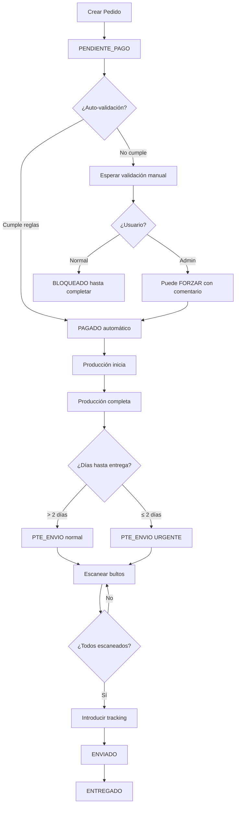

# 📦 Módulo Comercial

**Base de datos**: PRODUCTIVITY  
**Responsabilidad**: Gestión de pedidos comerciales, clientes y documentación

---

## 📋 Descripción

El módulo comercial gestiona todo el ciclo de vida de los **pedidos comerciales**, desde la creación hasta la entrega, incluyendo documentación, seguimiento de estados y gestión de clientes.

---

## 🗄️ Tablas

### `comercial_orders`
Pedidos comerciales completos.

**Columnas principales**:
- `id` - UUID del pedido
- `order_number` - Número de pedido (INT-YY-XXXX)
- `customer_name` - Nombre del cliente
- `customer_code` - Código de solicitud
- `customer_company` - Razón social
- `status` - Estado del pedido
- `delivery_region` - Región de entrega (PENINSULA, BALEARES, CANARIAS)
- `delivery_date` - Fecha de entrega
- `delivery_address` - Dirección completa
- `fabric` - Tela
- `color` - Color
- `quantity_total` - Cantidad total
- `lines` - JSONB con líneas de pedido
- `documents` - JSONB con documentos adjuntos

### `order_documents`
Documentos asociados a pedidos.

**Columnas principales**:
- `order_id` - Relación con comercial_orders
- `document_type` - Tipo (albarán, factura, presupuesto, contrato, otro)
- `document_url` - URL del documento en storage
- `file_name` - Nombre del archivo
- `uploaded_by` - Usuario que subió el documento

### `status_log`
Historial de cambios de estado.

**Columnas principales**:
- `order_id` - Relación con comercial_orders
- `old_status` - Estado anterior
- `new_status` - Estado nuevo
- `changed_by` - Usuario que hizo el cambio
- `notes` - Notas del cambio

---

## 📊 Estados de Pedido

| Estado | Descripción | Siguiente Estado |
|--------|-------------|------------------|
| `PENDIENTE_PAGO` | Pedido creado, esperando pago | PAGADO |
| `PAGADO` | Pago confirmado | EN_PROCESO |
| `EN_PROCESO` | En fabricación | PTE_ENVIO |
| `PTE_ENVIO` | Listo para enviar | ENVIADO |
| `ENVIADO` | En tránsito | ENTREGADO |
| `ENTREGADO` | Entregado al cliente | - |
| `CANCELADO` | Pedido cancelado | - |

---

## 🔒 Políticas RLS

```sql
-- Todos los autenticados pueden ver pedidos
CREATE POLICY "authenticated_can_view_comercial_orders"
  ON comercial_orders FOR SELECT
  USING (true);

-- Todos los autenticados pueden crear/editar
CREATE POLICY "authenticated_can_manage_comercial_orders"
  ON comercial_orders FOR ALL
  USING (true);
```

> [!NOTE]
> Las políticas actuales son permisivas. En producción se recomienda:
> - Solo managers pueden crear/editar pedidos
> - Operarios solo pueden ver
> - Clientes solo ven sus propios pedidos

---

## 🔄 Flujo de Pedido

```mermaid
graph LR
    A[Crear Pedido] --> B[PENDIENTE_PAGO]
    B --> C[Confirmar Pago]
    C --> D[PAGADO]
    D --> E[Iniciar Producción]
    E --> F[EN_PROCESO]
    F --> G[Completar Producción]
    G --> H[PTE_ENVIO]
    H --> I[Enviar]
    I --> J[ENVIADO]
    J --> K[Confirmar Entrega]
    K --> L[ENTREGADO]
```



---

## 📄 Componentes Principales

### Frontend

- **[CommercialPage.tsx](file:///c:/Users/Usuari/Documents/GitHub/MainV2/v3/egea-Main-control/src/pages/CommercialPage.tsx)** - Página principal del módulo
- **[src/components/commercial/](file:///c:/Users/Usuari/Documents/GitHub/MainV2/v3/egea-Main-control/src/components/commercial/)** - Componentes del módulo

### Backend (Supabase)

- **Función**: `generate_order_number()` - Genera número de pedido automático
- **Storage Bucket**: `order-docs` - Almacenamiento de documentos

---

## 🔧 Uso

### Crear Pedido

```typescript
const { data, error } = await supabaseProductivity
  .from('comercial_orders')
  .insert({
    order_number: await generateOrderNumber(),
    customer_name: 'Cliente Ejemplo',
    customer_code: 'CLI-001',
    delivery_region: 'PENINSULA',
    fabric: 'Algodón',
    color: 'Blanco',
    quantity_total: 100,
    status: 'PENDIENTE_PAGO'
  });
```

### Actualizar Estado

```typescript
// Actualizar estado del pedido
const { data, error } = await supabaseProductivity
  .from('comercial_orders')
  .update({ status: 'PAGADO' })
  .eq('id', orderId);

// Registrar en historial
await supabaseProductivity
  .from('status_log')
  .insert({
    order_id: orderId,
    old_status: 'PENDIENTE_PAGO',
    new_status: 'PAGADO',
    changed_by: userId,
    notes: 'Pago confirmado'
  });
```

### Subir Documento

```typescript
// Subir archivo a storage
const { data: uploadData, error: uploadError } = await supabaseProductivity
  .storage
  .from('order-docs')
  .upload(`${orderId}/${fileName}`, file);

// Registrar documento
await supabaseProductivity
  .from('order_documents')
  .insert({
    order_id: orderId,
    document_type: 'factura',
    document_url: uploadData.path,
    file_name: fileName,
    uploaded_by: userId
  });
```

---

## 🔐 Lógica Completa de Validación de Pedidos

El sistema implementa **3 etapas de validación** desde la creación del pedido hasta su salida de almacén, con controles automáticos y manuales.

---

## 📋 Etapa 1: Comercial - Habilitación para Producción

**Objetivo**: Pasar de `PENDIENTE_PAGO` → `PAGADO`

### Reglas de Integridad

**Ubicación**: `OrderDetailModal.tsx` - función `computeBlockingReasons`

El sistema evalúa automáticamente:

1. ✅ **Referencia Admin**: `admin_code` no puede estar vacío
2. ✅ **Documentación**: Deben existir documentos tipo:
   - `PRESUPUESTO`
   - `PEDIDO_ACEPTADO`
3. ✅ **Líneas de Medidas**: Al menos 1 línea cargada
4. ✅ **Integridad de Líneas**: Cada línea debe tener:
   - `width` (ancho) > 0
   - `height` (alto) > 0 y ≤ 280cm (restricción de fabricación)
   - `material` definido
   - `quantity` > 0

### Mecanismos de Disparo

#### 1. Auto-Validación (Automática)

**Ubicación**: `OrderDetailModal.tsx`

Se dispara automáticamente al:
- Subir/borrar documentos
- Guardar cambios en el pedido
- Modificar líneas de medidas

```typescript
// Si todas las reglas se cumplen, cambia a PAGADO automáticamente
if (computeBlockingReasons(order).length === 0) {
  await updateOrderStatus({ orderId: order.id, status: 'PAGADO' });
}
```

> [!NOTE]
> **Sin intervención humana**: Si el pedido cumple todos los requisitos, pasa a PAGADO automáticamente.

#### 2. Validación Manual (Botón VALIDAR)

**Ubicación**: `CommercialPage.tsx` - función `changeStatus`

**Para Usuarios Estándar**:
- ❌ **BLOQUEADO** si no cumple las reglas
- Muestra error específico de qué falta

**Para Administradores/Managers**:
- ✅ **PERMITE FORZAR** (Override) tras confirmación
- ⚠️ Requiere comentario obligatorio
- 📝 Registra en `order_activity` con prefijo `[OVERRIDE ADMIN]`

```typescript
// Validación con Override de Admin
if (newStatus === "PAGADO") {
  const check = validateOrderReadyForProduction(order);
  
  // Bloquear usuarios normales
  if (!check.valid && profile?.role !== 'admin' && profile?.role !== 'manager') {
    toast.error(`NO SE PUEDE ENVIAR:\n${check.error}`);
    return;
  }
  
  // Permitir override a admins con confirmación
  if (!check.valid && (profile?.role === 'admin' || profile?.role === 'manager')) {
    const confirmed = window.confirm(
      `⚠️ ADVERTENCIA ADMIN:\n${check.error}\n\n¿Forzar envío?\n\nNota: "${comment}"`
    );
    if (!confirmed) return;
  }
}
```

### Checklist de Validación Comercial

- [ ] **Número de Pedido** (`admin_code`)
- [ ] **Presupuesto** (PDF tipo `PRESUPUESTO`)
- [ ] **Pedido Aceptado** (PDF tipo `PEDIDO_ACEPTADO`)
- [ ] **Líneas de Medidas** (mínimo 1)
- [ ] **Ancho** de cada línea (> 0)
- [ ] **Alto** de cada línea (> 0 y ≤ 280cm)
- [ ] **Material** de cada línea
- [ ] **Cantidad** de cada línea (> 0)

---

## 🏭 Etapa 2: Producción - Control de Calidad y Plazos

**Objetivo**: Completar fabricación y marcar urgencias

### Validación de Entrega Crítica

**Ubicación**: `ProductionModule.tsx` - función `confirmProductionFinish`

Al finalizar la producción:

```typescript
// Calcular días hasta entrega
const daysUntilDelivery = differenceInDays(deliveryDate, today);

// Marcar como urgente si faltan ≤ 2 días
if (daysUntilDelivery <= 2) {
  await updateOrder({
    needs_shipping_validation: true,
    status: 'PTE_ENVIO'
  });
}
```

### Flag de Scrutiny

| Días hasta entrega | Flag | Acción |
|-------------------|------|--------|
| > 2 días | `needs_shipping_validation: false` | Envío normal |
| ≤ 2 días | `needs_shipping_validation: true` | ⚠️ Alerta en almacén |

> [!WARNING]
> **Pedidos Urgentes**: El flag `needs_shipping_validation: true` alerta al personal de almacén que el pedido requiere revisión especial o es urgente.

---

## � Etapa 3: Envío - Verificación Física y Logística

**Objetivo**: Pasar de `PTE_ENVIO` → `ENVIADO`

### Verificación de Bultos (Escaneo QR)

**Ubicación**: `ShippingModule.tsx` - función `handleScan`

**Requisitos**:
1. ✅ Escanear físicamente cada bulto con QR
2. ✅ `scanned_packages` debe igualar `packages_count`
3. ✅ Protección anti-mezcla (no se puede escanear otro pedido a medias)

```typescript
// Incrementar contador de escaneos
scanned_packages++;

// Validar que no se mezclen pedidos
if (currentOrderId !== scannedOrderId && scanned_packages > 0) {
  toast.error("Termina de escanear el pedido actual primero");
  return;
}

// Verificar completitud
if (scanned_packages === packages_count) {
  // Habilitar botón de envío
  setReadyToShip(true);
}
```

### Validación Final de Salida

**Ubicación**: `ShippingModule.tsx` - función `validateShipment`

**Obligatorio para liberar envío**:

- ✅ **Conteo Completo**: `scanned_packages === packages_count`
- ✅ **Tracking ID**: Número de seguimiento del transportista

```typescript
const validateShipment = () => {
  // Verificar conteo completo
  if (scanned_packages !== packages_count) {
    toast.error(`Faltan ${packages_count - scanned_packages} bultos por escanear`);
    return false;
  }
  
  // Verificar tracking
  if (!tracking_number || tracking_number.trim() === '') {
    toast.error("Introduce el número de seguimiento");
    return false;
  }
  
  return true;
};
```

### Checklist de Validación de Envío

- [ ] **Todos los bultos escaneados** (`scanned_packages === packages_count`)
- [ ] **Tracking ID** introducido
- [ ] **Sin mezcla de pedidos** (un pedido a la vez)

---

## 🔄 Flujo Completo de Validación



---

## 🛡️ Consideraciones Técnicas

### Integridad de Datos

> [!IMPORTANT]
> **Sin CHECK constraints en BD**: El esquema SQL (`public.comercial_orders`) NO contiene restricciones CHECK. La integridad depende 100% de la lógica en los componentes React.

### Trazabilidad

✅ **Todas las validaciones manuales** invocan `addLog`:
- Registra en tabla `order_activity`
- Incluye usuario, timestamp y comentario
- Las forzadas llevan prefijo `[OVERRIDE ADMIN]`

```typescript
addLog(
  order.order_number,
  `[OVERRIDE ADMIN] ${comment}`,
  profile.role,
  'PAGADO'
);
```

### Restricciones de Fabricación

⚠️ **Altura máxima**: 280cm
- Restricción en UI para evitar errores comunes
- Validada en `OrderDetailModal.tsx`

```typescript
if (line.height > 280) {
  errors.push("Altura máxima: 280cm");
}
```

---

## ✅ Verificación

### Test de Creación de Pedido

```sql
-- Verificar que se creó el pedido
SELECT * FROM comercial_orders WHERE order_number = 'INT-26-0001';

-- Verificar historial de estados
SELECT * FROM status_log WHERE order_id = 'uuid-del-pedido';

-- Verificar documentos
SELECT * FROM order_documents WHERE order_id = 'uuid-del-pedido';
```

---

## 🚨 Troubleshooting

### Error: "order_number already exists"
- El número de pedido debe ser único
- Usar la función `generate_order_number()` para generar automáticamente

### Error: "Invalid delivery_region"
- Solo se permiten: PENINSULA, BALEARES, CANARIAS
- Verificar que el valor es exacto (mayúsculas)

### Error: "Document upload failed"
- Verificar que el bucket 'order-docs' existe
- Verificar permisos de storage
- Verificar tamaño del archivo (máx 50MB)

---

**Última actualización**: 12 de enero de 2026
