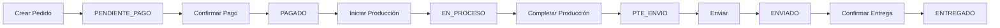

# 📦 Módulo Comercial

**Base de datos**: PRODUCTIVITY  
**Responsabilidad**: Gestión de pedidos comerciales, clientes y documentación

---

## 📋 Descripción

El módulo comercial gestiona todo el ciclo de vida de los **pedidos comerciales**, desde la creación hasta la entrega, incluyendo documentación, seguimiento de estados y gestión de clientes.

---

## 🗄️ Tablas

### `comercial_orders`
Pedidos comerciales completos.

**Columnas principales**:
- `id` - UUID del pedido
- `order_number` - Número de pedido (INT-YY-XXXX)
- `customer_name` - Nombre del cliente
- `customer_code` - Código de solicitud
- `customer_company` - Razón social
- `status` - Estado del pedido
- `delivery_region` - Región de entrega (PENINSULA, BALEARES, CANARIAS)
- `delivery_date` - Fecha de entrega
- `delivery_address` - Dirección completa
- `fabric` - Tela
- `color` - Color
- `quantity_total` - Cantidad total
- `lines` - JSONB con líneas de pedido
- `documents` - JSONB con documentos adjuntos

### `order_documents`
Documentos asociados a pedidos.

**Columnas principales**:
- `order_id` - Relación con comercial_orders
- `document_type` - Tipo (albarán, factura, presupuesto, contrato, otro)
- `document_url` - URL del documento en storage
- `file_name` - Nombre del archivo
- `uploaded_by` - Usuario que subió el documento

### `status_log`
Historial de cambios de estado.

**Columnas principales**:
- `order_id` - Relación con comercial_orders
- `old_status` - Estado anterior
- `new_status` - Estado nuevo
- `changed_by` - Usuario que hizo el cambio
- `notes` - Notas del cambio

---

## 📊 Estados de Pedido

| Estado | Descripción | Siguiente Estado |
|--------|-------------|------------------|
| `PENDIENTE_PAGO` | Pedido creado, esperando pago | PAGADO |
| `PAGADO` | Pago confirmado | EN_PROCESO |
| `EN_PROCESO` | En fabricación | PTE_ENVIO |
| `PTE_ENVIO` | Listo para enviar | ENVIADO |
| `ENVIADO` | En tránsito | ENTREGADO |
| `ENTREGADO` | Entregado al cliente | - |
| `CANCELADO` | Pedido cancelado | - |

---

## 🔒 Políticas RLS

```sql
-- Todos los autenticados pueden ver pedidos
CREATE POLICY "authenticated_can_view_comercial_orders"
  ON comercial_orders FOR SELECT
  USING (true);

-- Todos los autenticados pueden crear/editar
CREATE POLICY "authenticated_can_manage_comercial_orders"
  ON comercial_orders FOR ALL
  USING (true);
```

> [!NOTE]
> Las políticas actuales son permisivas. En producción se recomienda:
> - Solo managers pueden crear/editar pedidos
> - Operarios solo pueden ver
> - Clientes solo ven sus propios pedidos

---

## 🔄 Flujo de Pedido


```mermaid
graph LR
    A[Crear Pedido] --> B[PENDIENTE_PAGO]
    B --> C[Confirmar Pago]
    C --> D[PAGADO]
    D --> E[Iniciar Producción]
    E --> F[EN_PROCESO]
    F --> G[Completar Producción]
    G --> H[PTE_ENVIO]
    H --> I[Enviar]
    I --> J[ENVIADO]
    J --> K[Confirmar Entrega]
    K --> L[ENTREGADO]
```

---

## 📄 Componentes Principales

### Frontend

- **[CommercialPage.tsx](file:///c:/Users/Usuari/Documents/GitHub/MainV2/v3/egea-Main-control/src/pages/CommercialPage.tsx)** - Página principal del módulo
- **[src/components/commercial/](file:///c:/Users/Usuari/Documents/GitHub/MainV2/v3/egea-Main-control/src/components/commercial/)** - Componentes del módulo

### Backend (Supabase)

- **Función**: `generate_order_number()` - Genera número de pedido automático
- **Storage Bucket**: `order-docs` - Almacenamiento de documentos

---

## 🔧 Uso

### Crear Pedido

```typescript
const { data, error } = await supabaseProductivity
  .from('comercial_orders')
  .insert({
    order_number: await generateOrderNumber(),
    customer_name: 'Cliente Ejemplo',
    customer_code: 'CLI-001',
    delivery_region: 'PENINSULA',
    fabric: 'Algodón',
    color: 'Blanco',
    quantity_total: 100,
    status: 'PENDIENTE_PAGO'
  });
```

### Actualizar Estado

```typescript
// Actualizar estado del pedido
const { data, error } = await supabaseProductivity
  .from('comercial_orders')
  .update({ status: 'PAGADO' })
  .eq('id', orderId);

// Registrar en historial
await supabaseProductivity
  .from('status_log')
  .insert({
    order_id: orderId,
    old_status: 'PENDIENTE_PAGO',
    new_status: 'PAGADO',
    changed_by: userId,
    notes: 'Pago confirmado'
  });
```

### Subir Documento

```typescript
// Subir archivo a storage
const { data: uploadData, error: uploadError } = await supabaseProductivity
  .storage
  .from('order-docs')
  .upload(`${orderId}/${fileName}`, file);

// Registrar documento
await supabaseProductivity
  .from('order_documents')
  .insert({
    order_id: orderId,
    document_type: 'factura',
    document_url: uploadData.path,
    file_name: fileName,
    uploaded_by: userId
  });
```

---

## ✅ Verificación

### Test de Creación de Pedido

```sql
-- Verificar que se creó el pedido
SELECT * FROM comercial_orders WHERE order_number = 'INT-26-0001';

-- Verificar historial de estados
SELECT * FROM status_log WHERE order_id = 'uuid-del-pedido';

-- Verificar documentos
SELECT * FROM order_documents WHERE order_id = 'uuid-del-pedido';
```

---

## 🚨 Troubleshooting

### Error: "order_number already exists"
- El número de pedido debe ser único
- Usar la función `generate_order_number()` para generar automáticamente

### Error: "Invalid delivery_region"
- Solo se permiten: PENINSULA, BALEARES, CANARIAS
- Verificar que el valor es exacto (mayúsculas)

### Error: "Document upload failed"
- Verificar que el bucket 'order-docs' existe
- Verificar permisos de storage
- Verificar tamaño del archivo (máx 50MB)

---

**Última actualización**: 12 de enero de 2026
