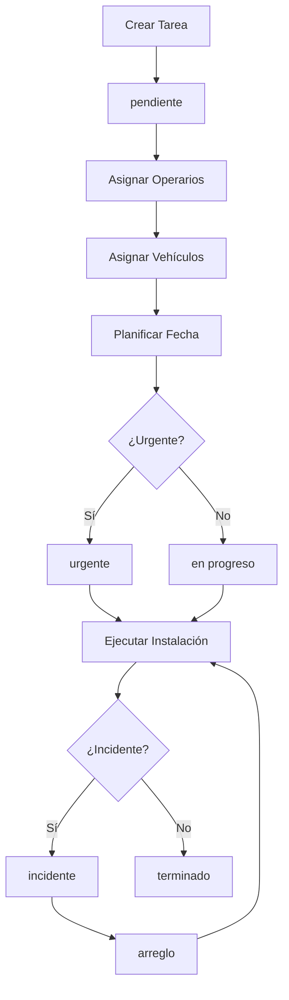

# 🏗️ Módulo de Instalaciones

**Base de datos**: MAIN  
**Responsabilidad**: Gestión de tareas de instalación, asignación de operarios y vehículos

---

## 📋 Descripción

El módulo de instalaciones gestiona las **tareas de campo**, incluyendo la planificación, asignación de recursos (operarios y vehículos), y seguimiento del estado de las instalaciones.

---

## 🗄️ Tablas

### `screen_data` (Tareas)
Tareas de instalación y trabajo de campo.

**Columnas principales**:
- `id` - UUID de la tarea
- `screen_id` - Relación con screens
- `data` - JSONB con datos de la tarea
- `state` - Estado (pendiente, urgente, en fabricacion, a la espera, terminado, incidente, arreglo)
- `status` - Status (pendiente, acabado, en progreso)
- `start_date` - Fecha de inicio
- `end_date` - Fecha de fin
- `location` - Ubicación
- `responsible_profile_id` - Responsable
- `assigned_to` - Asignado a

### `task_profiles`
Asignación de operarios a tareas.

**Columnas principales**:
- `task_id` - Relación con screen_data
- `profile_id` - Relación con profiles
- `assigned_at` - Fecha de asignación

### `task_vehicles`
Asignación de vehículos a tareas.

**Columnas principales**:
- `task_id` - Relación con screen_data
- `vehicle_id` - Relación con vehicles
- `assigned_at` - Fecha de asignación

---

## 📊 Estados de Tareas

| Estado | Descripción | Color |
|--------|-------------|-------|
| `pendiente` | Tarea creada, sin iniciar | Gris |
| `urgente` | Requiere atención inmediata | Rojo |
| `en fabricacion` | En proceso de fabricación | Azul |
| `a la espera` | Esperando material/aprobación | Amarillo |
| `terminado` | Tarea completada | Verde |
| `incidente` | Problema reportado | Naranja |
| `arreglo` | Requiere reparación | Morado |

---

## 🔒 Políticas RLS

```sql
-- Todos pueden ver tareas de pantallas activas
CREATE POLICY "anyone_can_view_active_screen_data"
  ON screen_data FOR SELECT
  USING (
    EXISTS (
      SELECT 1 FROM screens 
      WHERE screens.id = screen_data.screen_id 
      AND screens.is_active = true
    )
  );

-- Solo managers pueden gestionar tareas
CREATE POLICY "managers_can_manage_screen_data"
  ON screen_data FOR ALL
  USING (public.is_manager_or_admin());
```

---

## 🔄 Flujo de Instalación



---

## 📄 Componentes Principales

### Frontend

- **[InstallationsPage.tsx](file:///c:/Users/Usuari/Documents/GitHub/MainV2/v3/egea-Main-control/src/pages/InstallationsPage.tsx)** - Página principal
- **[CalendarModule.tsx](file:///c:/Users/Usuari/Documents/GitHub/MainV2/v3/egea-Main-control/src/components/dashboard/CalendarModule.tsx)** - Calendario de tareas
- **[TaskDialog.tsx](file:///c:/Users/Usuari/Documents/GitHub/MainV2/v3/egea-Main-control/src/components/installations/)** - Diálogo de edición

### Backend (Supabase)

- **Vista**: `detailed_tasks` - Vista optimizada con joins
- **Función**: `upsert_task()` - Crear/actualizar tareas

---

## 🔧 Uso

### Crear Tarea

```typescript
const createTask = async () => {
  const { data, error } = await supabaseMain
    .from('screen_data')
    .insert({
      screen_id: screenId,
      data: {
        site: 'Obra ABC',
        client: 'Cliente XYZ',
        address: 'Calle Principal 123',
        description: 'Instalación de sistema'
      },
      state: 'pendiente',
      status: 'pendiente',
      start_date: '2026-01-15',
      end_date: '2026-01-15',
      location: 'Madrid'
    });
};
```

### Asignar Operarios

```typescript
const assignOperators = async (taskId: string, operatorIds: string[]) => {
  // Eliminar asignaciones previas
  await supabaseMain
    .from('task_profiles')
    .delete()
    .eq('task_id', taskId);
  
  // Crear nuevas asignaciones
  const assignments = operatorIds.map(profileId => ({
    task_id: taskId,
    profile_id: profileId
  }));
  
  await supabaseMain
    .from('task_profiles')
    .insert(assignments);
};
```

### Asignar Vehículos

```typescript
const assignVehicles = async (taskId: string, vehicleIds: string[]) => {
  const assignments = vehicleIds.map(vehicleId => ({
    task_id: taskId,
    vehicle_id: vehicleId
  }));
  
  await supabaseMain
    .from('task_vehicles')
    .insert(assignments);
};
```

---

## 📅 Vista de Calendario

El módulo incluye un **calendario interactivo** que muestra:

- 📅 Tareas por fecha
- 👷 Operarios asignados
- 🚗 Vehículos asignados
- 🎨 Código de colores por estado
- 📍 Ubicación de la tarea

### Drag & Drop

Las tareas pueden arrastrarse entre fechas para reprogramar:

```typescript
const handleDrop = async (taskId: string, newDate: Date) => {
  await supabaseMain
    .from('screen_data')
    .update({ start_date: newDate })
    .eq('id', taskId);
};
```

---

## ✅ Checklist de Instalación

- [ ] Crear tarea con datos completos
- [ ] Asignar operarios necesarios
- [ ] Asignar vehículos
- [ ] Definir fecha y hora
- [ ] Verificar disponibilidad de recursos
- [ ] Confirmar ubicación
- [ ] Marcar como urgente si aplica
- [ ] Ejecutar instalación
- [ ] Reportar incidencias si hay
- [ ] Marcar como terminado

---

## 🚨 Troubleshooting

### Error: "No se pueden asignar operarios"
- **Causa**: Operario no disponible o en vacaciones
- **Solución**: Verificar `user_availability` y `status` del perfil

### Error: "Vehículo no disponible"
- **Causa**: Vehículo ya asignado a otra tarea
- **Solución**: Verificar `task_vehicles` para la fecha

### Tarea no aparece en calendario
- **Causa**: Screen no está activo
- **Solución**: Verificar `screens.is_active = true`

---

**Última actualización**: 12 de enero de 2026
