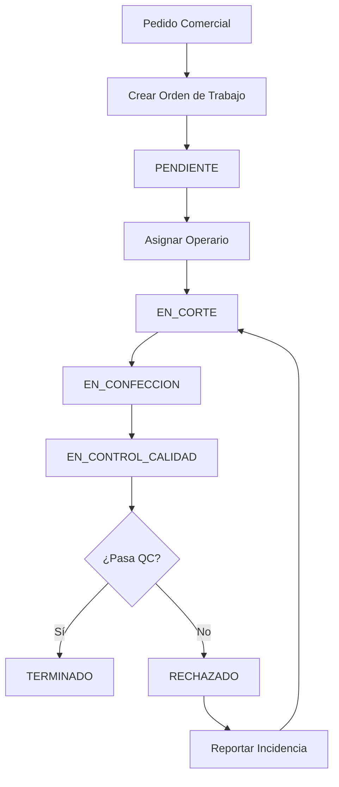

# 🏭 Módulo de Producción

**Base de datos**: PRODUCTIVITY  
**Responsabilidad**: Gestión de órdenes de trabajo, fabricación y control de calidad

---

## 📋 Descripción

El módulo de producción gestiona las **órdenes de trabajo** de fabricación, desde la asignación hasta el control de calidad final.

---

## 🗄️ Tablas

### `produccion_work_orders`
Órdenes de trabajo de producción.

**Columnas principales**:
- `id` - UUID de la orden
- `work_order_number` - Número de orden (WO-YY-XXXX)
- `comercial_order_id` - Relación con pedido comercial
- `product_type` - Tipo de producto
- `fabric` - Tela
- `color` - Color
- `quantity` - Cantidad
- `status` - Estado de producción
- `assigned_operator_id` - Operario asignado
- `quality_check_passed` - Control de calidad OK
- `started_at` - Fecha de inicio
- `completed_at` - Fecha de finalización

---

## 📊 Estados de Producción

| Estado | Descripción | Siguiente Estado |
|--------|-------------|------------------|
| `PENDIENTE` | Orden creada | EN_CORTE |
| `EN_CORTE` | En proceso de corte | EN_CONFECCION |
| `EN_CONFECCION` | En confección | EN_CONTROL_CALIDAD |
| `EN_CONTROL_CALIDAD` | Revisión de calidad | TERMINADO/RECHAZADO |
| `TERMINADO` | Producción completada | - |
| `RECHAZADO` | No pasó control de calidad | EN_CORTE |
| `EN_PAUSA` | Pausado temporalmente | Estado anterior |

---

## 🔄 Flujo de Producción



---

## 📄 Componentes Principales

### Frontend

- **[ProductionPage.tsx](file:///c:/Users/Usuari/Documents/GitHub/MainV2/v3/egea-Main-control/src/pages/ProductionPage.tsx)** - Página principal
- **[src/components/logistics/](file:///c:/Users/Usuari/Documents/GitHub/MainV2/v3/egea-Main-control/src/components/logistics/)** - Componentes de producción

### Backend

- **Función**: `generate_work_order_number()` - Genera número de orden automático

---

## 🔧 Uso

### Crear Orden de Trabajo

```typescript
const { data, error } = await supabaseProductivity
  .from('produccion_work_orders')
  .insert({
    work_order_number: await generateWorkOrderNumber(),
    comercial_order_id: orderId,
    product_type: 'Cortina',
    fabric: 'Algodón',
    color: 'Blanco',
    quantity: 10,
    status: 'PENDIENTE'
  });
```

### Asignar Operario

```typescript
await supabaseProductivity
  .from('produccion_work_orders')
  .update({
    assigned_operator_id: operatorId,
    status: 'EN_CORTE',
    started_at: new Date().toISOString()
  })
  .eq('id', workOrderId);
```

### Control de Calidad

```typescript
await supabaseProductivity
  .from('produccion_work_orders')
  .update({
    quality_check_passed: true,
    quality_checked_by: inspectorId,
    quality_checked_at: new Date().toISOString(),
    status: 'TERMINADO',
    completed_at: new Date().toISOString()
  })
  .eq('id', workOrderId);
```

---

**Última actualización**: 12 de enero de 2026
