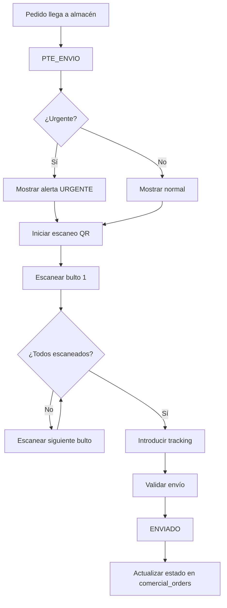

# 📦 Módulo de Almacén (Warehouse)

**Base de datos**: PRODUCTIVITY  
**Responsabilidad**: Gestión de logística, envíos y verificación física de bultos

---

## 📋 Descripción

El módulo de almacén gestiona la **etapa final** del flujo de pedidos: la verificación física de bultos mediante escaneo QR y el registro de envíos con tracking de transportista.

---

## 🗄️ Tablas

### `logistics`
Gestión de envíos y logística.

**Columnas principales**:
- `id` - UUID del envío
- `order_id` - Relación con comercial_orders
- `shipping_method` - Método (MENSAJERIA, TRANSPORTE, RECOGIDA, OTRO)
- `tracking_number` - Número de seguimiento
- `carrier` - Transportista
- `status` - Estado del envío
- `scheduled_date` - Fecha programada
- `shipped_at` - Fecha de envío real
- `delivered_at` - Fecha de entrega
- `warehouse_location` - Ubicación en almacén
- `packages_count` - Número de bultos
- `total_weight` - Peso total

### `materials`
Catálogo de materiales y stock.

**Columnas principales**:
- `code` - Código único del material
- `name` - Nombre del material
- `category` - Categoría (tela, hilo, accesorio, embalaje, otro)
- `stock_quantity` - Cantidad en stock
- `min_stock_quantity` - Stock mínimo
- `unit_price` - Precio unitario
- `supplier` - Proveedor

---

## 📊 Estados de Logística

| Estado | Descripción | Siguiente Estado |
|--------|-------------|------------------|
| `PENDIENTE` | Esperando preparación | PREPARANDO |
| `PREPARANDO` | En proceso de empaquetado | LISTO_PARA_ENVIO |
| `LISTO_PARA_ENVIO` | Todos los bultos escaneados | EN_TRANSITO |
| `EN_TRANSITO` | Enviado con transportista | ENTREGADO |
| `ENTREGADO` | Entregado al cliente | - |
| `DEVUELTO` | Devuelto por transportista | PENDIENTE |
| `CANCELADO` | Envío cancelado | - |

---

## 🔐 Validación de Envío (Etapa 3)

### Requisitos Obligatorios

**Ubicación**: `ShippingModule.tsx`

Para pasar de `PTE_ENVIO` → `ENVIADO`:

1. ✅ **Escaneo Completo de Bultos**
   - `scanned_packages === packages_count`
   - Cada bulto debe escanearse físicamente con QR

2. ✅ **Tracking ID**
   - Campo `tracking_number` obligatorio
   - Puede escanearse o escribirse manualmente

3. ✅ **Sin Mezcla de Pedidos**
   - No se puede escanear otro pedido hasta completar el actual
   - Protección anti-error

### Flujo de Escaneo

```typescript
// Función handleScan en ShippingModule.tsx
const handleScan = (qrData: string) => {
  const scannedOrderId = extractOrderId(qrData);
  
  // Validar que no se mezclen pedidos
  if (currentOrderId && currentOrderId !== scannedOrderId && scanned_packages > 0) {
    toast.error("Termina de escanear el pedido actual primero");
    return;
  }
  
  // Incrementar contador
  scanned_packages++;
  
  // Verificar completitud
  if (scanned_packages === packages_count) {
    setReadyToShip(true);
    toast.success("Todos los bultos escaneados. Listo para enviar");
  }
};
```

### Validación Final

```typescript
const validateShipment = () => {
  // 1. Verificar conteo completo
  if (scanned_packages !== packages_count) {
    toast.error(`Faltan ${packages_count - scanned_packages} bultos por escanear`);
    return false;
  }
  
  // 2. Verificar tracking
  if (!tracking_number || tracking_number.trim() === '') {
    toast.error("Introduce el número de seguimiento del transportista");
    return false;
  }
  
  return true;
};
```

---

## 🚨 Flag de Urgencia

### `needs_shipping_validation`

Este flag se activa en la **Etapa 2 (Producción)** cuando faltan ≤ 2 días para la entrega.

**Comportamiento en Almacén**:
- ⚠️ Pedidos con flag `true` se muestran con **alerta visual**
- 🔴 Prioridad alta en la lista de envíos
- 📋 Requiere revisión especial antes de enviar

```typescript
// Mostrar alerta visual
{order.needs_shipping_validation && (
  <Badge variant="destructive" className="animate-pulse">
    ⚠️ URGENTE - Entrega en ≤ 2 días
  </Badge>
)}
```

---

## 🔄 Flujo Completo de Almacén



---

## 📄 Componentes Principales

### Frontend

- **[ShippingModule.tsx](file:///c:/Users/Usuari/Documents/GitHub/MainV2/v3/egea-Main-control/src/components/logistics/)** - Módulo de envíos
- **QR Scanner** - Escaneo de bultos
- **Tracking Input** - Entrada de número de seguimiento

---

## 🔧 Uso

### Escanear Bultos

```typescript
// Iniciar escaneo
const startScanning = (orderId: string) => {
  setCurrentOrderId(orderId);
  setScannedPackages(0);
  setReadyToShip(false);
};

// Procesar escaneo
const handleScan = (qrCode: string) => {
  // Validar y registrar escaneo
  registerPackageScan(qrCode);
};
```

### Enviar Pedido

```typescript
const shipOrder = async () => {
  // Validar
  if (!validateShipment()) return;
  
  // Actualizar estado
  await supabaseProductivity
    .from('comercial_orders')
    .update({
      status: 'ENVIADO',
      tracking_number: trackingNumber,
      shipped_at: new Date().toISOString()
    })
    .eq('id', orderId);
    
  // Registrar en logistics
  await supabaseProductivity
    .from('logistics')
    .insert({
      order_id: orderId,
      tracking_number: trackingNumber,
      status: 'EN_TRANSITO',
      shipped_at: new Date().toISOString()
    });
};
```

---

## ✅ Checklist de Envío

- [ ] Verificar que el pedido está en `PTE_ENVIO`
- [ ] Revisar si tiene flag de urgencia
- [ ] Escanear todos los bultos (QR)
- [ ] Verificar `scanned_packages === packages_count`
- [ ] Introducir tracking number
- [ ] Confirmar transportista
- [ ] Enviar pedido
- [ ] Verificar cambio a `ENVIADO`

---

## 🚨 Troubleshooting

### Error: "Termina de escanear el pedido actual"
- **Causa**: Intentando escanear otro pedido sin completar el actual
- **Solución**: Completar escaneo del pedido actual o cancelar

### Error: "Faltan X bultos por escanear"
- **Causa**: No se han escaneado todos los bultos
- **Solución**: Escanear los bultos faltantes

### Error: "Introduce el número de seguimiento"
- **Causa**: Campo tracking vacío
- **Solución**: Escanear o escribir el tracking del transportista

---

**Última actualización**: 12 de enero de 2026
